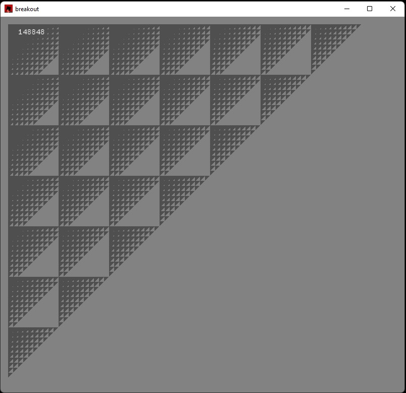

# perf tech test task
 тестовое задание на логику и вледение ЯП.

### Тестовое задание
На бесконечной координатной сетке находится муравей.

Муравей может перемещатся на 1 клетку
вверх (x,y+1),
вниз (x,y-1),
влево (x-1,y),
вправо (x+1,y), по одной клетке за шаг.

Клетки, в которых сумма цифр в координате X плюс сумма цифр в координате Y больше чем 25 недоступны муравью.

Например, клетка с координатами (59, 79) недоступна, т.к. 5+9+7+9=30, что больше 25.

Сколько cклеток может посетить муравей если его начальная позиция (1000,1000), (включая начальную клетку).

Прислать ответ и решение в виде числа клеток и исходного текста программы на языке Python или rust решающей задачу. 

### Решение

Как именно будет происходить заполнение доступных путей, изначально, мне было не очевидно.
Решение методом добавления доступных позиций от начальной, 
с визуальным контролем, показалось надежным. Выполнено на языке Rust.

`app/src/main.rs`

Результат 148848. 

#### Решение на Rust
В решении без дробления вычислений результат получен примерно за 10 минут.

В решении где отбрасывались не возможные и совершенные шаги результат за 29 секунд.
steps: 148848
time: 29.0583537

#### Решение на Python 2
Решение без отрисовки, только расчеты.
Steps taken: 148848
Elapsed time: 8.8
